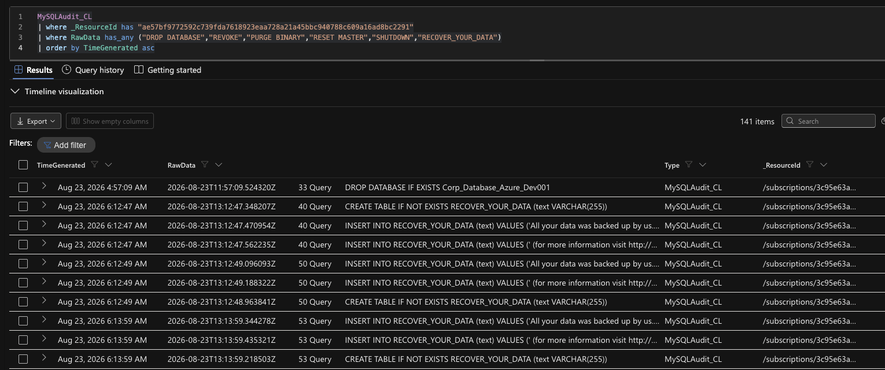

# Azure Honeypot Threat Hunting Lab 🕵️‍♂️

An Azure-hosted MySQL honeypot built to practice detection engineering, log analysis, and DFIR against a live, unscripted breach. Rather than working from a canned dataset, this lab exposed a real database to the internet, captured real attacker activity, and used that traffic to build and tune detection rules in Microsoft Sentinel.


Built on the lognpacific cyber-range platform, then extended with custom detection rules, DFIR analysis, and incident write-ups.

## Overview

- **Target:** Azure VM (`corp-sql-server`) running MySQL, deliberately exposed with weak credentials (`root`/`root`) to attract attacker traffic
- **Telemetry:** MySQL audit logs ingested into Log Analytics, plus endpoint telemetry from Microsoft Defender for Endpoint (MDE)
- **Detection:** Custom KQL analytics rules in Microsoft Sentinel, tuned against observed attacker behavior
- **Outcome:** Confirmed a live ransomware deployment and a separate interactive RDP compromise, both traced and documented from raw logs through to a written incident report

## Lab Environment

| Component | Details |
|---|---|
| Host | Azure VM — ARM resource name `corp-sql-server1`, OS hostname `corp-sql-server` |
| Database | MySQL, general query logging enabled (`general_log=1` in `my.ini`) |
| Log pipeline | Data Collection Rule (DCR) ingesting MySQL audit logs into a custom `MySQLAudit_CL` table |
| Credentials | Intentionally weak: `root`/`root`, exposed as both `'root'@'%'` and `'root'@'localhost'` |
| Background noise | Scheduled cyber-range simulation scripts (port scans, EICAR test files, simulated ransomware) run every ~12 minutes and were explicitly filtered out of attacker attribution |

> **Note on naming:** the OS hostname is truncated to 15 characters by the Windows NetBIOS limit during VM provisioning, while the ARM resource name is not. MDE tables (`DeviceLogonEvents`, `DeviceInfo`) reference the OS hostname; Azure Monitor tables (`MySQLAudit_CL`) reference the ARM resource name in `_ResourceId`. This mismatch was a recurring source of confusion early on — always verify the actual `DeviceName` with a quick `DeviceInfo | distinct DeviceName` query rather than assuming it.

## Detection Engineering

Sentinel analytics rules were tuned to the attack pattern actually observed in this environment — brute-force attempts escalating to a successful breach within roughly 5 minutes:

- **Query frequency:** every 5 minutes
- **Lookback period:** 5–10 minutes
- **Alert suppression:** 1 hour
- **Incident grouping:** all matching events grouped into a single incident over a 1-hour window

Example detection logic:

```kql
// SQL Server
let MyDevice = "corp-sql-server1";
let MyTimeframe = todatetime("2026-09-03T19:48:06.1427846Z");
let FailedConnections =
MySQLAudit_CL
| extend RawData = replace_string(RawData, "\t", " ")
| extend DeviceName = tostring(split(_ResourceId, "/")[-1])
| where DeviceName == MyDevice
| where RawData has "Access denied"
| extend ConnectionId = extract(@"^\S+\s+(\d+)\s+Connect", 1, RawData)
| distinct ConnectionId;
MySQLAudit_CL
| where TimeGenerated > MyTimeframe
| extend RawData = replace_string(RawData, "\t", " ")
| extend DeviceName = tostring(split(_ResourceId, "/")[-1])
| where DeviceName == MyDevice
| where RawData has "Connect"
| extend ConnectionId = extract(@"^\S+\s+(\d+)\s+Connect", 1, RawData)
| extend ActionType =
    case(
        RawData has "Access denied", "LogonFailure",
        ConnectionId in (FailedConnections), "Ignore",
        "LogonSuccess"
    )
| where ActionType != "Ignore"
| extend RawData = replace_string(RawData, "\t", " ")
| extend Username = replace_string(tostring(split(tostring(split(RawData,"@")[0]), " ")[-1]), "'", "")
| extend IpAddress = replace_string(tostring(split(split(RawData,"@")[1], " ")[0]), "'", "")
| project TimeGenerated, DeviceName, Username, IpAddress, ActionType, RawData
| order by TimeGenerated desc

```

```kql
// Filtering Queries
let MyDevice = "corp-sql-server1"; // set your own device name
let ServerVulnerableDateTime = todatetime("2026-09-03T19:48:06.1427846Z");
MySQLAudit_CL
| where TimeGenerated > ServerVulnerableDateTime
| where RawData has "Query"
| extend RawData = replace_string(RawData, "\t", " ")
| extend DeviceName = tostring(split(_ResourceId, "/")[-1])
| where DeviceName == MyDevice
| extend ActionType = "Query"
| extend Query = split(RawData, "Query")[1]
| project TimeGenerated, DeviceName, ActionType, Query, RawData
| order by TimeGenerated desc

```

```kql
// Virtual Machine Logons
let MyDevice = "corp-sql-server"; // MDE Truncates/cuts off the device name
let ServerVulnerableDateTime = todatetime("2026-09-03T19:48:06.1427846Z");
DeviceLogonEvents
| where TimeGenerated > ServerVulnerableDateTime
| where DeviceName == MyDevice
| where AccountName in~ ("administrator", "guest")
| project TimeGenerated, RemoteIP, AccountName, DeviceName, ActionType, LogonType
```
A couple of hard-won KQL lessons baked into these queries:
- Use `=~` instead of `==` for string comparisons — logging sources are inconsistent about case
- `endswith` requires the *full* correct suffix (including trailing characters like the `1` in `corp-sql-server1`); `contains` is looser but can mask an underlying naming mismatch instead of catching it

## Investigation & Key Findings

**Confirmed ransomware deployment with anti-forensic destruction.** On Sep 2, 09:44 AM, an attacker at `64.89.163.141` inserted two distinct ransom notes into a decoy database, then revoked its own privileges, purged the binary logs, and shut down the MySQL service — a deliberate attempt to destroy the audit trail.

```kql
MySQLAudit_CL
| where _ResourceId has "ae57bf9772592c739fda7618923eaa728a21a45bbc940788c609a16ad8bc2291"
| where RawData has_any ("DROP DATABASE","REVOKE","PURGE BINARY","RESET MASTER","SHUTDOWN","RECOVER_YOUR_DATA")
| order by TimeGenerated asc
```


---

**Attributed the attack to a specific source IP through thread-ID correlation**, not just timing proximity — cross-referencing the auth log's connection thread against the query log's thread confirmed `64.89.163.141` as the session that ran the ransomware.

```kql
MySQLAudit_CL
| where _ResourceId has "ae57bf9772592c739fda7618923eaa728a21a45bbc940788c609a16ad8bc2291"
| where TimeGenerated between (datetime(2026-09-02T09:40:00Z) .. datetime(2026-09-02T09:45:00Z))
| where RawData has "Connect" and RawData !has "Access denied"
| project TimeGenerated, RawData
| order by TimeGenerated asc
```


---

**Confirmed a successful interactive RDP compromise** of the Windows `Administrator` account — a session logged in at 3:37 AM, sat idle/locked for ~9 hours, then was unlocked and actively used through the evening.

```kql
let MyDevice = "corp-sql-server";
DeviceLogonEvents
| where DeviceName == MyDevice
| where AccountName =~ "administrator"
| where LogonType in ("RemoteInteractive", "Unlock") or ActionType == "LogonSuccess"
| project TimeGenerated, RemoteIP, ActionType, LogonType
| order by TimeGenerated asc
```


---

**Ruled out a false lead instead of reporting it as an attack.** A script cycle downloading and running `portscan.ps1`/`eicar.ps1`/`pwncrypt.ps1` every ~12 minutes initially looked like attacker tooling, but traced back to the course's own cyber-range platform generating training telemetry, not adversary behavior.

```kql
DeviceProcessEvents
| where DeviceName == "corp-sql-server"
| where ProcessCommandLine has_any ("portscan.ps1", "eicar.ps1", "pwncrypt.ps1")
| project TimeGenerated, FileName, ProcessCommandLine
```


---

A telemetry gap is also worth noting: comparing MDE's `DeviceLogonEvents` table against the raw Windows Security event log (`4625`) showed one attacking IP generating **59x more failed-logon events** in the raw log than what reached the advanced-hunting table. Full IOC lists, ATT&CK mapping, and a scoped list of unresolved questions are in the reports below.

## Lessons Learned

- Always verify hostname/resource-name mapping empirically rather than assuming consistency across log sources
- String matching in KQL needs to account for case and suffix precision, or detections silently miss events
- Scheduled background "noise" (lab simulation scripts, in this case) needs to be explicitly excluded before attributing activity to a real attacker
- Table-based EDR telemetry can undersample real attacker activity — raw forensic packages remain necessary for a complete picture
- Suppression and grouping windows should be derived from the *observed* attack tempo, not left at defaults

## Tools & Stack

`Azure (VMs, NSG, Log Analytics, DCR, Run Command)` · `Microsoft Sentinel` · `Microsoft Defender for Endpoint` · `MySQL` · `KQL`
